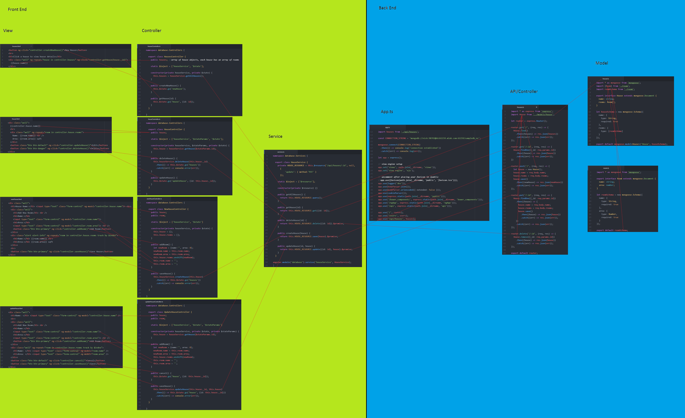

# Student Walk Through

This repo is to help students see how the different layers of the application map to eachother. The diagram helps students see the dataflow from a code call hierachy point of view.

